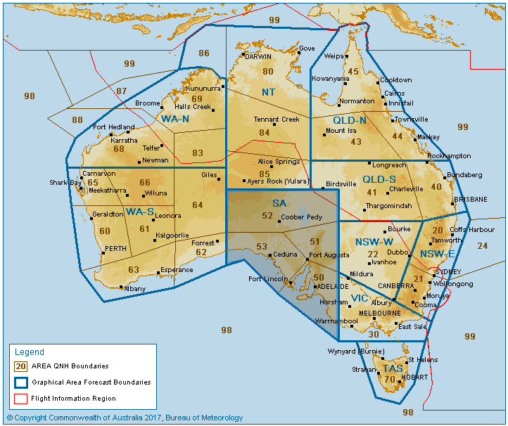
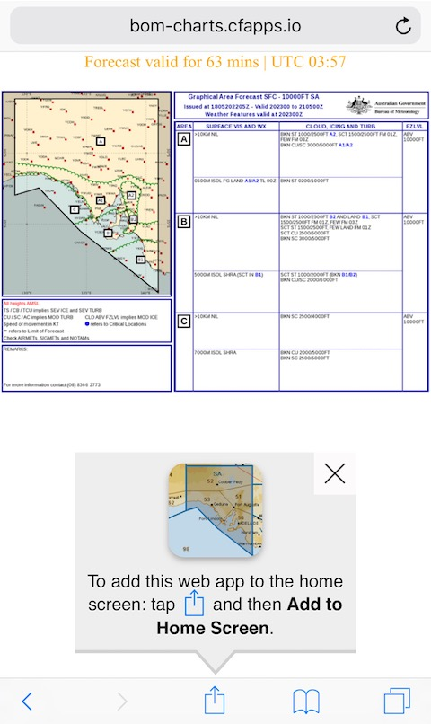

# Australian Bureau of Meteorology for mobile browsers

The http://www.bom.gov.au site isn't designed for mobile devices and its images cannot be permanently linked. This site is an optimisation for some of its graphs or information.

## Graphical Area Forecasts

Visit https://bom-charts.cfapps.io/gaf in your mobile device.

Click on an area of the map.

Add the dedicated GAF page to place an icon on your mobile home screen.

