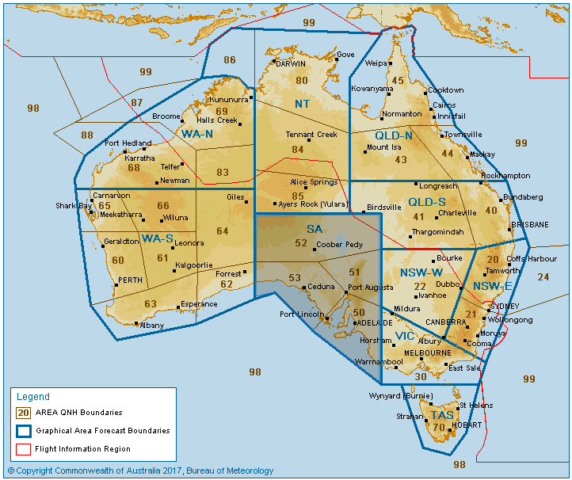
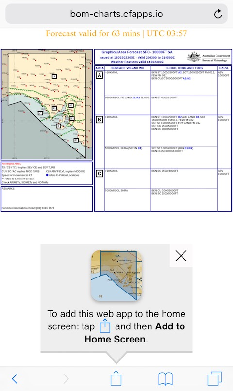
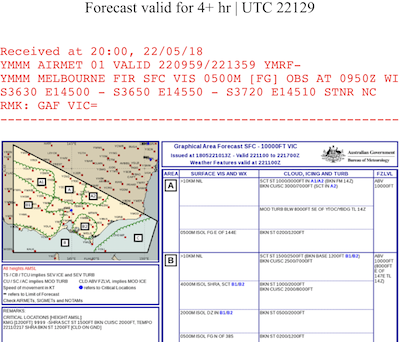

# Australian Bureau of Meteorology for mobile browsers

The http://www.bom.gov.au site isn't designed for mobile devices and its images cannot be permanently linked. This site is an optimisation for some of its graphs or information.

## Graphical Area Forecasts

Visit https://bom-charts.cfapps.io/gaf in your mobile device.

Click on an area of the map.

Add the dedicated GAF page to place an icon on your mobile home screen.

If an AIRMET is published that affects your area it will be displayed at the top of the page.

## Forecasts

Visit https://bom-charts.cfapps.io/synoptic to see the 4-day forecast via synoptic charts. You can bookmark this page for quick reference.